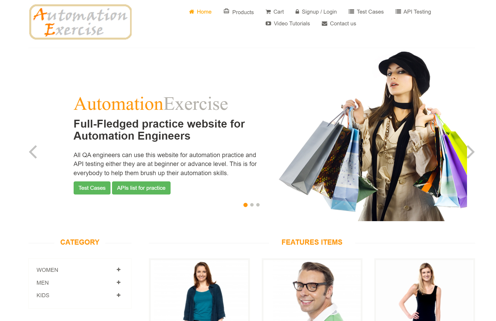
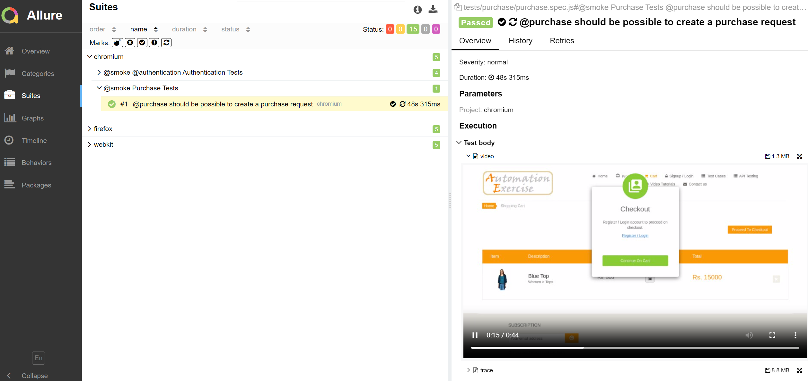

# Automation Challenge by Apply Digital

> Automation technical challenge with JavaScript and [Playwright](https://playwright.dev/) 🎭

<p align="center">
  
</p>

## About Technologies and Architecture 🚀

#### The project uses structures for large-scale maintenance, performance and reuse, such as:

- Javascript: easy-to-understand language, with a low learning curve. It has support for WEB, API and Mobile automations (using Appium)
- Playwright: performative and modern tool for test automation
- Page Objects Model: object orientation was used as abstraction, encapsulation and segmentation of responsibilities, we have a gain in the organization and reuse of code in the pages
- Centralized test data with control structure (factory)
- Components to maintenance, performance and reuse code
- Multi-environment configuration (dynamic test data)
- Parallel execution (playwright bring it ready)
- Multiple browsers (playwright bring it ready)
- Deep validations (feature validated as a whole)
- Real e2e tests -> simulating user
- Happy and sad flow validation (successful and exceptions)
- CSS Selector: element mapping

## Test Documentation 📚

To know about Test plan, Design, and Strategy: [Test Documentation](TESTDOC.md).

## Requirements ⚡

- [Node.js](https://nodejs.org)
- [Yarn](https://yarnpkg.com)
- [VSCode](https://code.visualstudio.com)

### VSCode Required Extensions

- `VisualStudioExptTeam.vscodeintellicode`
- `EditorConfig.EditorConfig`
- `dbaeumer.vscode-eslint`
- `esbenp.prettier-vscode`

### VSCode Recommended Extensions

- `christian-kohler.path-intellisense`
- `aaron-bond.better-comments`
- `PKief.material-icon-theme`
- `oderwat.indent-rainbow`
- `Gruntfuggly.todo-tree`
- `natqe.reload`

### Setup ⚙️

### Install Browser and Dependencies

1. Install project dependencies

```
yarn install
```

2. Install playwright dependencies

```
yarn setup
```

## How to Run 🎡

### Test Running

- Run all tests:

```
yarn test
```

- Run debug mode:

```
yarn test:debug
```

- Run headed mode:

```
yarn test:headed
```

### View Reports

- View html report:

```
yarn report:html
```

- View error trace:

```
yarn report:trace [path/url to trace.zip]
```

### Test Running Options

- Specify tag

```
-g [@tag_you_want]
```

- Specify browser

```
--project [chromium|firefox|webkit]
```

## Dependencies 🔧

- [playwright](https://playwright.dev)
- [expect-playwright](https://github.com/playwright-community/expect-playwright)
- [faker](https://fakerjs.dev)
- [eslint](https://eslint.org)
- [eslint-plugin-playwright](https://github.com/playwright-community/eslint-plugin-playwright)
- [prettier](https://prettier.io)

### Reports 📂

At the end of the execution, the test evidences will be generated in the `reports` folder.

Besides that, Github Actions is configured with Allure and the reports can be viewed in the description of the project or [here.](https://manuletsgo.github.io/applydigital-automation-challenge)

Some things that could be found in the Allure Report:

- Video - available only at broken and retries tests (need to access the test suite - check below)
- Trace - available only at broken and retries tests (need to access the test suite - check below)
- Metrics
- Trend
- Duration

Example available of video and trace  on a retried test:
<p>
  
</p>

How to access a video or trace in the previous run tests:
<p>
  
</p>
